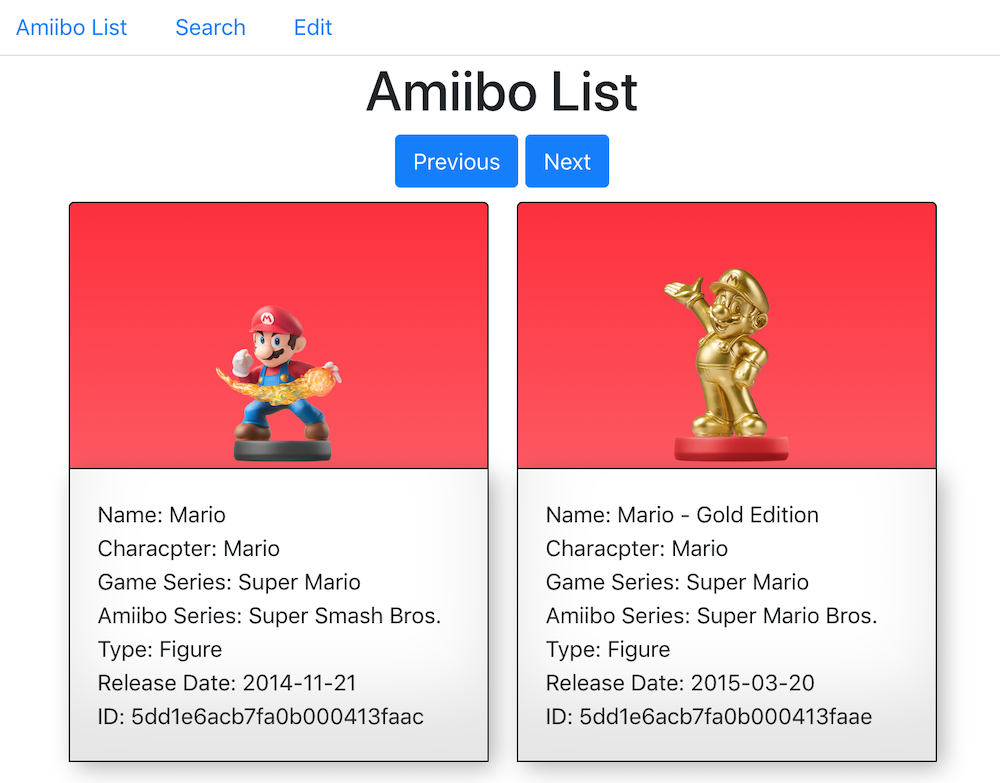

# Amiibo API Front End Project

## Description
This is the front end for the [Amiibo API](https://github.com/wchrapcynski/Amiibo-API) that I put together. It completes the first ever MERN stack application that I've built. This version is set up to run via the local version of the API (master branch) as well as the version running on Heroku (deployment branch). [Bootstrap](https://getbootstrap.com/) was used as a basis for CSS.

## Requirements

- [Node JS](https://nodejs.org/en/)
- [Mongo DB](https://www.mongodb.com/download-center)

## Installation

After downloading this repo to your local machine or web server, youll need to run `npm install` from the root directory of the project to install any dependencies. If you're running in from your local machine, you can run the command `npm start` from instead the project directory to run the Node JS server.

## Usage

This project currently has full CRUD. It's a bit on the basic side right now but I plan to work on better functional inegration as I continue. The Amiibo List tab gives you a basic listing of everything in the database. You can click on next or previous to traverse the data. The Search tab gives you various ways to search through the database and the Edit tab lets you update, create new, or delete a document. 

## Future Updates

Right now you have to do a lot of work manually. I hope to have things set up where you edit a particular listing by clicking on it. I would also like to have search functions on the main listing page. In the end, I think it should be a two page app. There also needs to be some basic sorting features. Right now only North American release dates are used and I'd like to be able to let a user switch to other locales.  

## Author

William Chrapcynski: all code